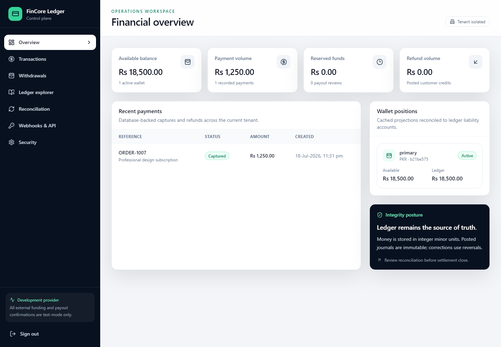
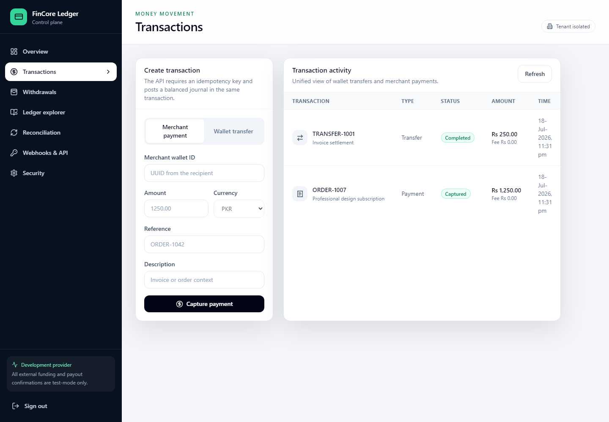
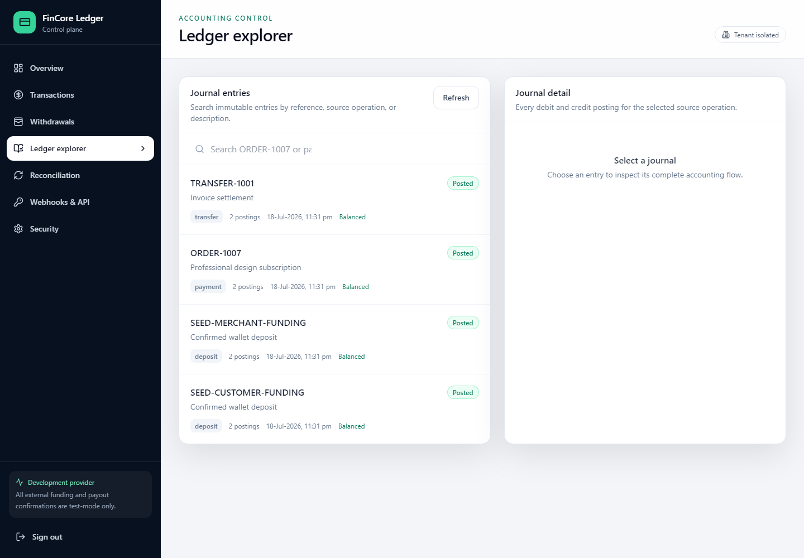
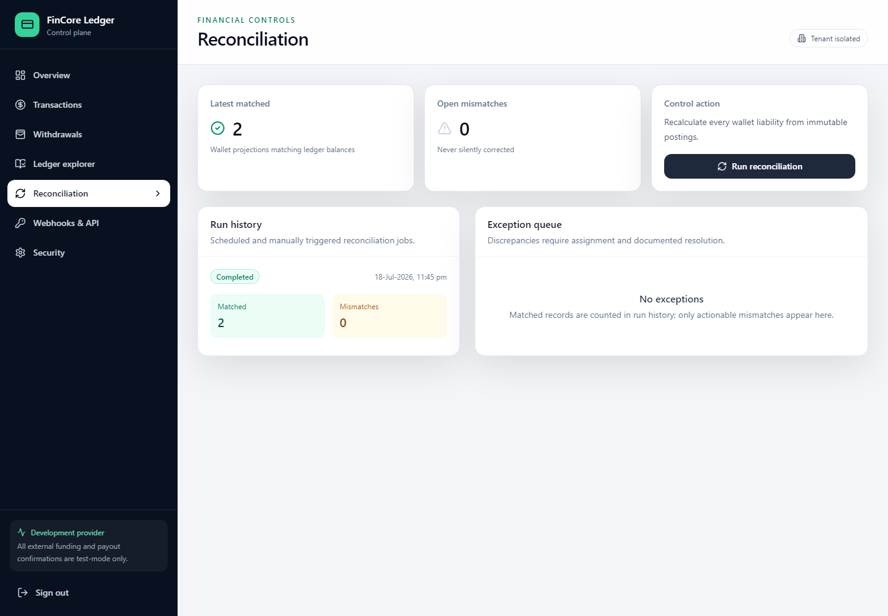
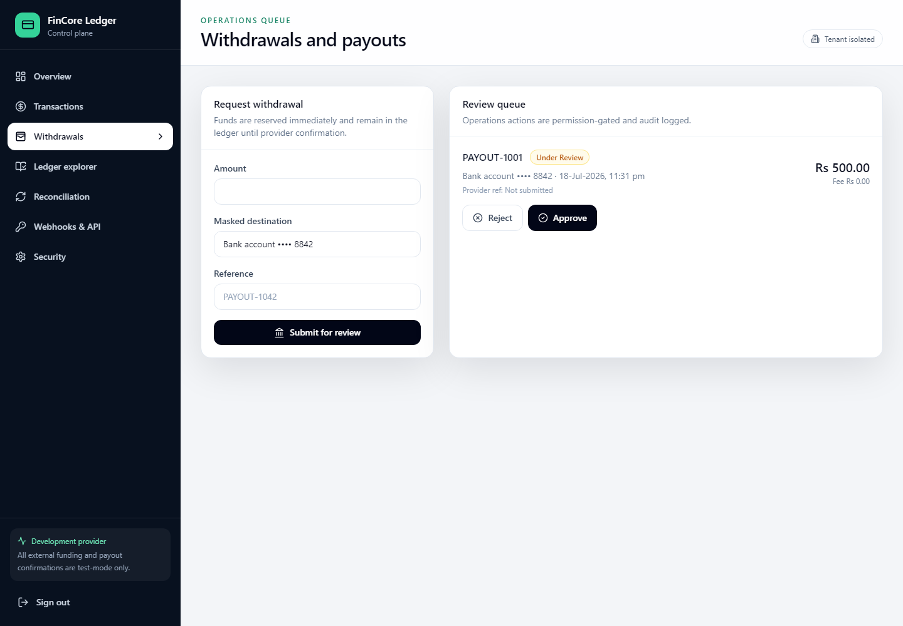
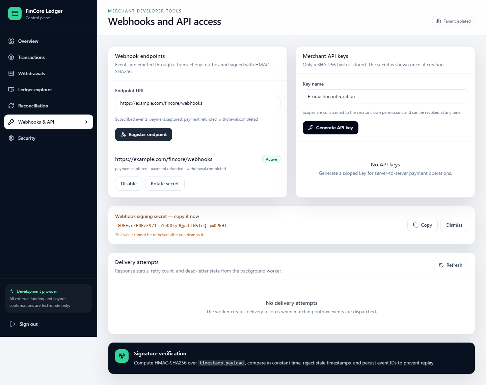
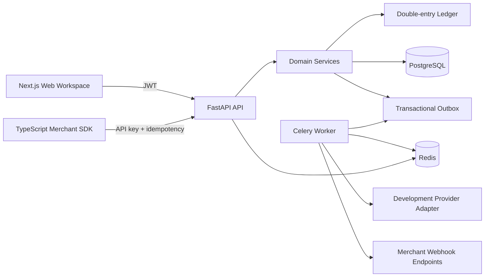

# FinCore Ledger

[](https://github.com/HUSNAIN-MUNAWAR/fincore-ledger/actions/workflows/ci.yml)
[](LICENSE)
[](apps/api/pyproject.toml)
[](apps/web/package.json)
[](apps/api/fincore/main.py)
[](apps/web/package.json)
[](docker-compose.yml)

FinCore Ledger is a ledger-first wallet and payment operations platform for building auditable money-movement workflows with immutable double-entry accounting.

> FinCore Ledger is an engineering reference implementation. It is not a licensed payment institution, PCI DSS certification, SOC 2 attestation, central-bank approval, or permission to process unrestricted real-world funds. The included provider adapter and seed data are development-only.

## Why This Exists

Many wallet demos treat balances as mutable fields and add accounting later. FinCore Ledger starts from the opposite direction: posted journals and balanced debit/credit postings are the source of truth, while wallet balances are operational projections that can be reconciled.

The project is intended for engineers, reviewers, and teams exploring how to structure wallet, merchant-payment, withdrawal, webhook, reconciliation, and operations workflows without pretending the reference implementation is a finished regulated payments business.

## Features

- Multi-tenant organizations, memberships, roles, permissions, JWT access tokens, rotated refresh sessions, API keys, and audit logging.
- Customer and merchant wallets with available, pending, reserved, and ledger-balance projections.
- Immutable double-entry journals with debit/credit postings, source references, reversals, and chart-of-accounts helpers.
- Idempotent transfers, merchant payments, deposits, refunds, withdrawal reservation/review/payout confirmation, fees, and limits.
- HMAC-signed merchant webhooks, encrypted signing secrets, transactional outbox, retry history, and dead-letter states.
- Operations UI for dashboards, transactions, withdrawals, ledger exploration, reconciliation, webhooks/API access, and security context.
- FastAPI backend, Next.js frontend, Celery worker, PostgreSQL/Redis Docker Compose stack, Alembic migrations, tests, and a TypeScript merchant SDK.

## Screenshots

All screenshots below were captured from the application running locally against seeded demo data.

| Dashboard | Transactions |
|---|---|
|  |  |

| Ledger | Reconciliation |
|---|---|
|  |  |

| Withdrawals | Webhooks |
|---|---|
|  |  |

Additional captures: [development login](docs/screenshots/login-development-accounts.png), [OpenAPI schema endpoint](docs/screenshots/api-openapi-schema.png).

## Architecture



The backend is a modular monolith. Route handlers own transport concerns, domain services enforce financial rules, SQLAlchemy owns persistence, and worker/provider boundaries can be extracted later without distributing the ledger prematurely.

## Technology Stack

- Backend: Python 3.12, FastAPI, SQLAlchemy 2, Alembic, Pydantic, PyJWT, Argon2, Ruff, MyPy, Pytest.
- Frontend: Node.js 22, Next.js 15, React 19, TypeScript, Tailwind CSS, TanStack Query, React Hook Form, Zod, Lucide icons.
- Async/runtime: Celery, Redis, PostgreSQL 16, Docker Compose.
- SDK: TypeScript client for merchant API-key workflows and webhook verification.

## Quick Start With Docker Compose

Requirements: Docker Engine with Compose v2.

```bash
cp .env.example .env
# Replace FINCORE_JWT_SECRET before any shared or persistent deployment.
docker compose up --build
```

Services:

- Web: `http://localhost:3000`
- API docs: `http://localhost:8000/docs`
- ReDoc: `http://localhost:8000/redoc`
- Liveness: `http://localhost:8000/health/live`
- Readiness: `http://localhost:8000/health/ready`

The API container runs Alembic migrations and seeds development data by default. Set `FINCORE_SEED_ON_START=false` to skip seeding.

## Local Development

Backend:

```bash
python -m pip install -r apps/api/requirements-dev.txt
cd apps/api
FINCORE_DATABASE_URL=sqlite:///./fincore-local.db alembic upgrade head
FINCORE_DATABASE_URL=sqlite:///./fincore-local.db python -m fincore.seed
FINCORE_DATABASE_URL=sqlite:///./fincore-local.db uvicorn fincore.main:app --reload
```

Windows PowerShell users can replace `python` with the Python launcher:

```powershell
py -3.12 -m pip install -r apps\api\requirements-dev.txt
```

Frontend:

```bash
cd apps/web
npm ci
NEXT_PUBLIC_API_URL=http://localhost:8000/api/v1 npm run dev
```

Worker:

```bash
docker compose up postgres redis api worker beat
```

SQLite is useful for isolated tests and smoke checks. PostgreSQL is the intended runtime database for concurrent money movement.

## Demo Data

Run `python -m fincore.seed` after migrations to create fictional demo organizations, wallets, ledger postings, and users. All seeded identities use the development-only password `FinCore-Dev-2026!`.

| Persona | Email | Intended access |
|---|---|---|
| Platform administrator | `admin@fincore.example` | Administration, finance, compliance, audit |
| Operations reviewer | `ops@fincore.example` | Withdrawal, ledger, reconciliation, compliance operations |
| Merchant administrator | `merchant@fincore.example` | Merchant payments, refunds, API keys, webhooks |
| Customer | `customer@fincore.example` | Wallet, transfer, deposit, withdrawal, payment |

## API Examples

Login:

```bash
curl -s http://localhost:8000/api/v1/auth/login \
  -H 'Content-Type: application/json' \
  -d '{"email":"customer@fincore.example","password":"FinCore-Dev-2026!"}'
```

Create an idempotent transfer:

```bash
curl -X POST http://localhost:8000/api/v1/transfers \
  -H "Authorization: Bearer $ACCESS_TOKEN" \
  -H 'Content-Type: application/json' \
  -H 'Idempotency-Key: transfer-order-1007' \
  -d '{
    "sender_wallet_id":"<customer-wallet-id>",
    "receiver_wallet_id":"<receiver-wallet-id>",
    "amount":250000,
    "currency":"PKR",
    "reference":"ORDER-1007",
    "description":"Invoice settlement"
  }'
```

More examples are in [docs/api-examples.md](docs/api-examples.md). The TypeScript SDK is documented in [packages/sdk](packages/sdk/README.md).

## Commands

Backend:

```bash
cd apps/api
python -m ruff check .
python -m mypy fincore --no-incremental
python -m pytest -q
alembic upgrade head
```

Frontend:

```bash
cd apps/web
npm ci
npm run lint
npm run typecheck
NEXT_TELEMETRY_DISABLED=1 npm run build
```

SDK:

```bash
cd packages/sdk
npm ci
npm run typecheck
npm run build
```

Smoke test against a running API:

```bash
FINCORE_API_URL=http://localhost:8000/api/v1 python scripts/smoke_test.py
```

There is no standalone CLI application; `scripts/smoke_test.py` is the project-level command-line smoke check.

## Configuration

Use [.env.example](.env.example) as the template. Do not commit real `.env` files.

| Variable | Purpose |
|---|---|
| `FINCORE_ENV` | `development`, `test`, or `production` behavior |
| `FINCORE_DATABASE_URL` | SQLAlchemy database URL |
| `FINCORE_REDIS_URL` | Redis broker/cache URL |
| `FINCORE_JWT_SECRET` | JWT signing and development secret-encryption root |
| `FINCORE_ACCESS_TOKEN_MINUTES` | Access-token lifetime |
| `FINCORE_REFRESH_TOKEN_DAYS` | Refresh-session lifetime |
| `FINCORE_CORS_ORIGINS` | Comma-separated allowed web origins |
| `FINCORE_ALLOWED_HOSTS` | Comma-separated trusted HTTP hosts |
| `FINCORE_PROVIDER_MODE` | Provider registry mode; only `development` is included |
| `FINCORE_WEBHOOK_WORKER_ENABLED` | Enables delivery processing |
| `FINCORE_RATE_LIMIT_PER_MINUTE` | Per-client in-process API limit |
| `NEXT_PUBLIC_API_URL` | Browser-visible API base URL |

## Project Structure

```text
fincore-ledger/
├── apps/
│   ├── api/          FastAPI app, SQLAlchemy models, Alembic, services, tests
│   ├── web/          Next.js operations/customer/merchant workspace
│   └── worker/       Celery worker image
├── packages/
│   ├── sdk/          TypeScript merchant SDK
│   └── shared-types/ Shared event contract types
├── docs/             Architecture, accounting, security, API, deployment, screenshots
├── infrastructure/   PostgreSQL initialization
├── scripts/          Verification and smoke-test scripts
└── docker-compose.yml
```

## Documentation

- [Architecture](docs/architecture.md)
- [Ledger design](docs/ledger-design.md)
- [Chart of accounts](docs/chart-of-accounts.md)
- [Payment lifecycle](docs/payment-lifecycle.md)
- [Security model](docs/security-model.md)
- [Reconciliation](docs/reconciliation.md)
- [Provider integration](docs/provider-integration.md)
- [API examples](docs/api-examples.md)
- [Deployment](docs/deployment.md)
- [Production readiness](docs/production-readiness.md)
- [Verification record](docs/verification.md)

## Security Notes

- Never commit `.env`, provider credentials, API keys, webhook signing secrets, raw access tokens, local databases, or real customer financial data.
- The included provider adapter is development-only.
- The app stores no card number, CVV, or online-banking credential.
- Production deployments need independent legal, licensing, AML/KYC, data-protection, payment-provider, security, and operational review.

Responsible disclosure guidance is in [SECURITY.md](SECURITY.md).

## Known Constraints

- The rate limiter is process-local; production should enforce distributed gateway or Redis-backed limits.
- SQLite is not recommended for concurrent production money movement.
- Official payment-provider sandbox certification is outside the included development adapter.
- Docker Compose is provided, but Docker was not installed in the current verification environment, so container startup was not executed here.

## Contributing

Read [CONTRIBUTING.md](CONTRIBUTING.md), keep changes focused, and include tests for financial behavior. New money-moving endpoints must preserve idempotency, tenant isolation, and double-entry ledger invariants.

## Roadmap

- Add first-class provider sandbox adapters behind the existing provider interface.
- Add stronger reconciliation exception assignment workflows and exports.
- Add MFA/passkeys and device/session management for the web workspace.
- Add Redis-backed distributed rate limiting.
- Add end-to-end browser tests for seeded demo workflows.

## License

MIT. See [LICENSE](LICENSE).

## Attribution

FinCore Ledger is built with the open-source libraries listed in the Python and npm lock/configuration files. Demo organizations, names, balances, and transactions are fictional and generated by the seed script.
