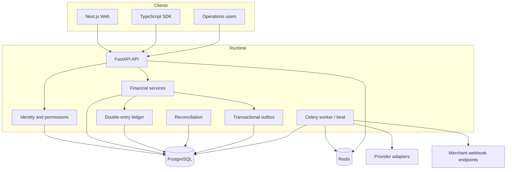
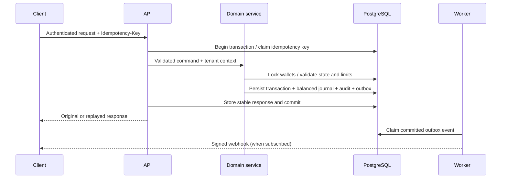

# Architecture

## Design choice

FinCore Ledger uses a modular monolith. One transactional PostgreSQL boundary owns the ledger and financial state, avoiding distributed transactions while preserving domain boundaries suitable for future extraction. FastAPI routes translate HTTP requests; application services enforce permissions, tenancy, state transitions, limits, fees, locking, accounting, audit, and outbox creation.

## Components

## Domain boundaries

- **Identity and access:** users, memberships, roles, permissions, refresh sessions, API keys.
- **Tenancy:** organization-scoped access and explicit cross-organization merchant/customer relationships.
- **Wallets and ledger:** wallet projections, ledger accounts, journals, postings, reversals.
- **Transactions:** transfers, payments, captures, refunds, deposits, withdrawals, fee snapshots, limits.
- **Operations:** compliance reviews, audit logs, administrative adjustments, reports.
- **Reliability:** idempotency, provider-event deduplication, outbox, webhook retries, reconciliation.

## Request lifecycle

## Tenancy

The authenticated context includes a user, active organization membership, role, and permission set. Wallet lists and customer-side transaction queries are organization-scoped. Merchant users can inspect resources tied to their merchant organization. Platform operations permissions allow explicitly controlled cross-tenant review. Services re-check ownership; route checks are not the sole boundary.

## Transaction boundaries

Each money-moving service executes within the request database transaction. Critical wallet rows are selected `FOR UPDATE` on PostgreSQL in deterministic ID order. Journal creation, balance projections, transaction state, audit records, and outbox events commit together.

## Future extraction

Webhook delivery, provider polling, reports, and notifications are natural service candidates. The ledger should remain a single-authority component unless a rigorously designed distributed accounting protocol is introduced.
