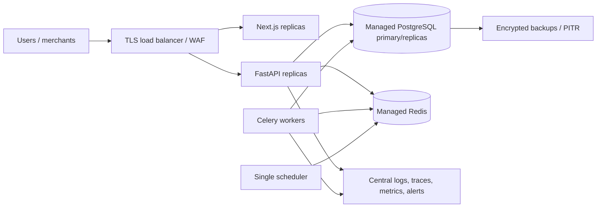

# Deployment

## Development Compose

```bash
cp .env.example .env
docker compose up --build
```

Compose starts PostgreSQL, Redis, API, Celery worker, Celery beat, and Next.js. API startup applies Alembic migrations. Development seed-on-start is configurable.

## Migration workflow

```bash
cd apps/api
alembic upgrade head
alembic current
```

Create reviewed migrations rather than relying on `Base.metadata.create_all` in deployed environments. Test both upgrade and rollback paths against a disposable database before release.

## Production topology



## Required production changes

- Replace development provider and seed behavior.
- Use managed secrets and independent JWT/encryption keys.
- Restrict hosts, CORS, networks, database roles, and admin endpoints.
- Use TLS for every hop and signed images from a registry.
- Run multiple API/worker replicas but exactly one scheduler leader.
- Use Redis-backed/global rate limiting at the edge.
- Configure PostgreSQL isolation, statement timeouts, connection pools, backups, PITR, HA, and restore drills.
- Store logs in tamper-resistant centralized infrastructure with PII redaction.
- Add error tracking, job-lag alerts, outbox backlog alerts, reconciliation alerts, and financial control dashboards.

## Release checks

```bash
./scripts/verify.sh
docker compose build
docker compose up -d
python scripts/smoke_test.py
docker compose down
```

Do not promote a release when migrations, financial invariant tests, reconciliation checks, or provider contract tests fail.
