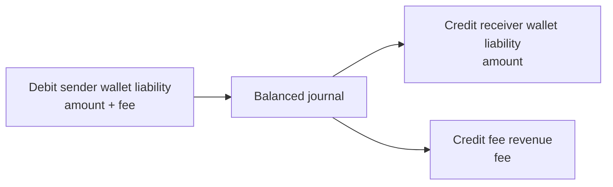
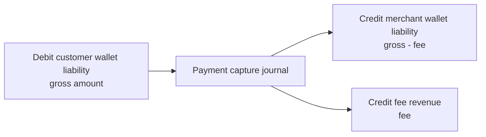
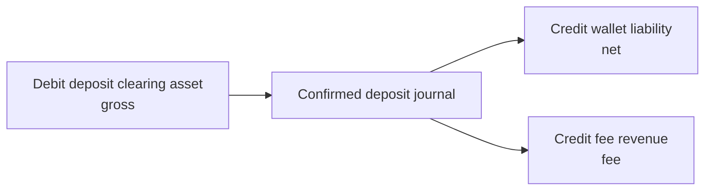
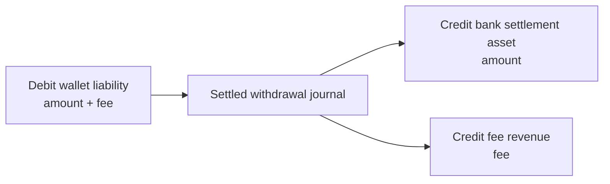

# Ledger Design

## Source of truth

`journal_entries` and `ledger_postings` are the authoritative financial history. Wallet balance columns are projections for authorization and display and are checked by reconciliation. They are never directly overwritten through an administrative endpoint.

Money is stored in integer minor units. For example, PKR 1,250.50 is `125050`.

## Posting invariant

A journal requires at least two positive postings and must satisfy:

```text
sum(debits) = sum(credits)
```

The service also verifies that every referenced account exists and uses the journal currency. Posting to a wallet account updates its ledger projection according to the account's normal balance. A transaction that would create a negative wallet ledger or available balance fails and rolls back.

## Account normal balances

- Assets and expenses normally carry debit balances.
- Liabilities and revenue normally carry credit balances.
- Wallet balances are represented as liability accounts because the platform owes those funds to customers or merchants.

## Transfer posting



No money is created: the sender liability decreases by the receiver increase plus platform revenue.

## Merchant payment posting



Manual authorization first moves the amount from available to reserved without posting a capture journal. Capture posts the journal and releases the reservation through the projection logic.

## Deposit posting



A deposit remains pending until a provider confirmation is verified or a development-mode confirmation is explicitly authorized.

## Withdrawal posting

Funds are reserved at request time. After review and provider confirmation:



A rejection releases the reservation without creating a settlement journal. A provider request alone does not mark the withdrawal complete.

## Refund posting

A refund reverses the captured economic flow for the requested amount by debiting merchant liability and crediting customer liability. Multiple partial refunds are accepted only while their sum is less than or equal to the captured amount. Payment status is recalculated to `partially_refunded` or `refunded`.

## Immutability and corrections

Posted journals are not edited or deleted by application workflows. Technical reversals create a new journal with every direction inverted and link it through `reversal_of_id`. Administrative adjustments require elevated permission, explicit debit and credit accounts, an equal amount, and a mandatory justification recorded in the audit log.

## Concurrency

Wallets are locked before debit authorization. Multiple wallets are locked in sorted ID order to reduce deadlock risk. Database uniqueness protects transaction references and idempotency records. SQLite tests model the invariant, while PostgreSQL provides the intended row-lock behavior.
