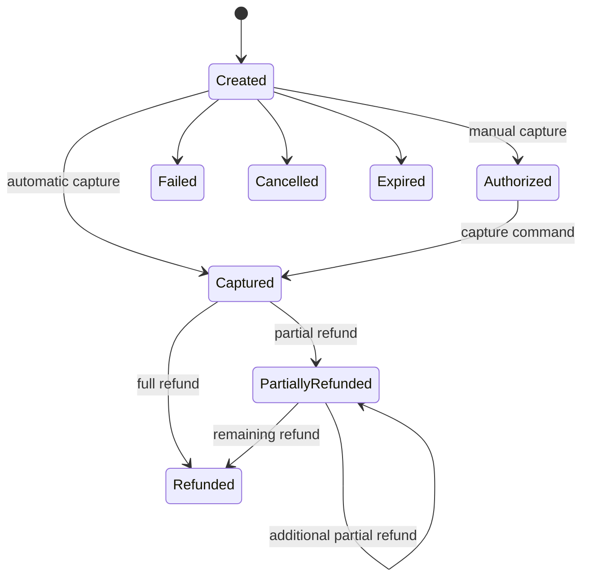
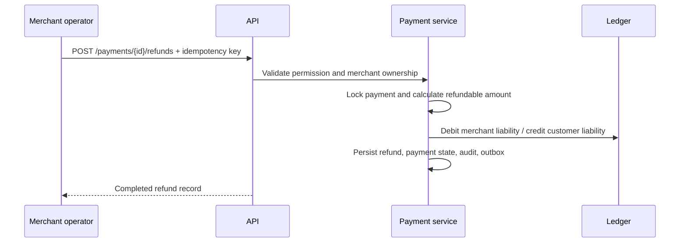

# Payment Lifecycle

## States

`created`, `requires_action`, `processing`, `authorized`, `captured`, `partially_refunded`, `refunded`, `failed`, `cancelled`, and `expired` are modeled. The implemented wallet payment path uses validated transitions for automatic capture or manual authorization/capture.

## Automatic capture

1. Validate tenant, wallet status, currency, limits, and available funds.
2. Snapshot the merchant-specific or default fee rule.
3. Lock customer and merchant wallets.
4. Persist payment and event history.
5. Post customer debit, merchant credit, and optional fee revenue.
6. Persist audit and outbox records.
7. Commit atomically and return a stable idempotent response.

## Manual capture

Authorization reduces customer available balance and increases reserved balance. Capture later posts the journal once, releases the reservation, changes the payment state, and emits the event.

## Refund flow

Fees are not automatically returned in the current business-refund policy. A different fee policy should be implemented explicitly rather than mutating historical fee snapshots.
