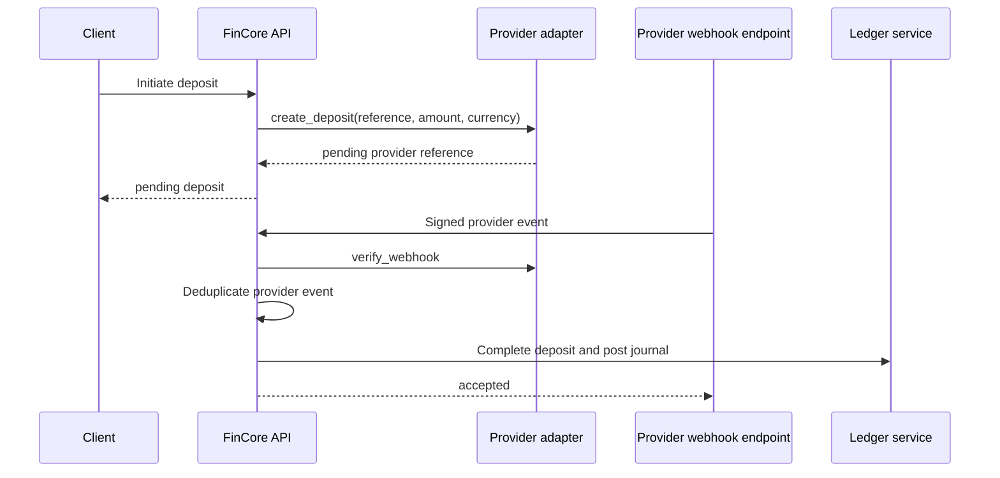

# Provider Integration

## Adapter contract

Provider implementations conform to the `PaymentProvider` interface for deposit creation/retrieval, payout creation, webhook verification, and payment refund operations. The registry selects an adapter from configuration.

## Included adapter

`DevelopmentProvider` produces pending references and verifies development HMAC callbacks. It never represents a production processor. Completion requires an operations permission and an explicit development confirmation endpoint or a verified development provider event.

## Adding an official sandbox

1. Implement the provider interface in `fincore/providers/`.
2. Keep credentials in environment/secret storage; never commit them.
3. Normalize provider statuses without assuming a request means settlement.
4. Verify callbacks using the provider's official signing scheme and timestamp tolerance.
5. Store a unique provider event/reference before processing.
6. Map provider confirmation to idempotent domain transitions.
7. Add contract, signature, replay, failure, polling, and reconciliation tests against the official sandbox.
8. Document refund and payout semantics, timeout behavior, and dispute limitations.

## Failure behavior

Unavailable providers return a safe domain error. Pending transactions remain pending. Workers may poll status idempotently. Failed or ambiguous results must enter operations/reconciliation review rather than being marked successful.
