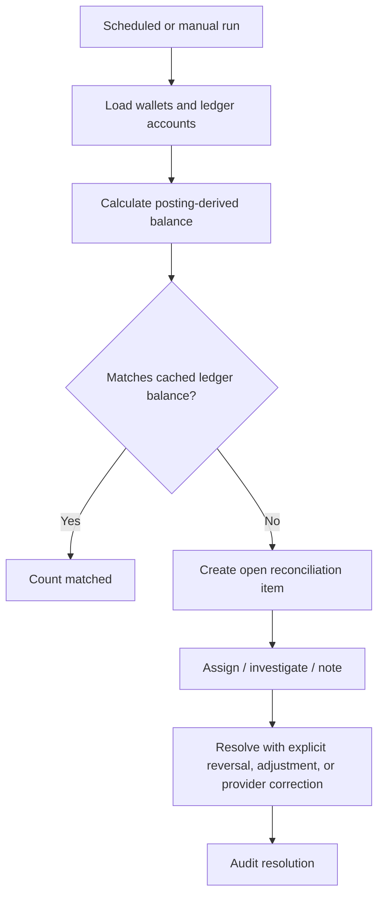

# Reconciliation

Reconciliation never silently changes financial data. It compares authoritative ledger-derived wallet balances with cached projections and records discrepancies as reviewable items.

## Internal checks

- Missing wallet ledger account.
- Cached ledger balance mismatch.
- Negative or inconsistent available/reserved projections.
- Journal debit/credit imbalance detection in operational inspection.

## Provider checks

The schema and provider-event records support status, amount, currency, missing-record, and duplicate-reference checks. A real provider adapter should supply a normalized settlement/transaction feed. The included development adapter does not claim external reconciliation.

## Workflow

Each run stores status, start/end timestamps, matched count, mismatch count, and item rows. Items retain issue type, internal/provider references, expected/actual values, assignment, notes, and resolution status. A discrepancy is resolved by an explicit accounting or provider operation—not by changing a balance field.

## Suspense

A production chart may include reviewed suspense accounts. Moving a discrepancy to suspense requires a balanced administrative adjustment, elevated permission, documented justification, and follow-up ownership.
